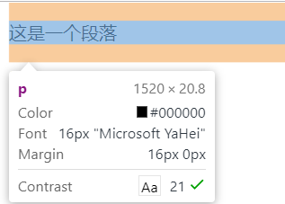

# DOM

* [DOM](#dom)
	* [什么是DOM](#什么是dom)
	* [window对象和document对象](#window对象和document对象)
	* [获取HTML元素](#获取html元素)
		* [1. getElementById()](#1-getelementbyid)
		* [2. getElementsByTagName()](#2-getelementsbytagname)
		* [3. getElementsByClassName()](#3-getelementsbyclassname)
		* [4. querySelector()](#4-queryselector)
		* [5. querySelectorAll()](#5-queryselectorall)
	* [操作HTML元素的属性](#操作html元素的属性)
	* [操作HTML元素的style](#操作html元素的style)
	* [修改DOM中的内容](#修改dom中的内容)
		* [innerHTML：获取元素里的内容](#innerhtml获取元素里的内容)
		* [innerText](#innertext)
		* [document.write](#documentwrite)

## 什么是DOM
JavaScript分为三个部分，分别为ECMAScript、DOM、BOM。
其中	DOM 是 文档对象模型（Document Object Model，简称DOM），是W3C组织推荐的处理可扩展标志语言的标准编程接口。在网页上，组织页面（或文档）的对象被组织在一个树形结构中，用来表示文档中对象的标准模型。

## window对象和document对象
window对象是包含document对象的。window对象是JS的最外层对象而document对象是DOM的最外层对象。

## 获取HTML元素

```
 console.log( document.doctype );   //    <!DOCTYPE html>
    
 console.log( document.documentElement );    //  <html>

 console.log( document.head );     // <head>

 console.log( document.body );     // <body>

 console.log( document.title );     // <title>中的内容 -> Document

 document.title = 'nihao';     // 还可以设置

  //注：.的含义，就是谁谁谁下的，下一级的意思。

```

**注意：document.title获取到的不是title标签而是标签中的内容！**  

**获取HTML元素通常有以下几种方法**

**获取元素操作的时候，尽量放在下边，让HTML元素加载完，要不然会获取不到**

### 1. getElementById()
通过id获取元素

```
var elem = document.getElementById('elem'); 
```

### 2. getElementsByTagName()

**注意Elements有s！且获取到的为一个集合**

```
var lis = document.getElementsByTagName('li');
```

### 3. getElementsByClassName()

**注意Elements有s！且获取到的为一个集合**

```
var boxs = document.getElementsByClassName('box');  
```

**getElementById的前边只可以是document，而getElementsByTagName和getElementsByClassName不一定**

### 4. querySelector()
仿照CSS选择器而诞生的，写法和CSS选择器类似

```
var elem = document.querySelector('#elem')
```

### 5. querySelectorAll()
仿照CSS选择器而诞生的，写法和CSS选择器类似，返回的是一个集合。

```
var boxs = document.querySelectorAll('.box'); 
var lis = document.querySelectorAll('ul li');  
```

## 操作HTML元素的属性

**注：class关键字被JS中的面向对象中的类所占用了，用className来获取class样式属性，同样的，for被JS中的循环占用了，所以HTML中的for属性需要写成htmlFor**

```
console.log( elem.id );
console.log( elem.title );
console.log( elem.zidingyi );   // .的方式获取不到自定义属性
console.log( elem.className ); 
console.log( lab.htmlFor );
```

## 操作HTML元素的style
JS种不能出现短线- , 短线去掉转驼峰写法;

例如CSS中的```font-size:16px```

在JS中就应该写成```fontSize:16px```

```
var elem = document.getElementById('elem');     
elem.style.background = 'red';
elem.style.color = 'white';
elem.style.width = '100px'; 
//cssText可以简化样式的设置操作 , 注意会把style样式进行整体覆盖掉
elem.style.cssText = 'width:100px;background:red;color:white';
```
这种方法只能改变元素的内联样式，如果写的内部样式或者外部样式，应该怎么办呢？  
这里提供一种方法```getComputedStyle()```  它获取的是元素的最终样式，即不管你是哪里的CSS，我只抓住最后呈现在页面上的样式！（挺霸道的……我感觉）

```
var elem = document.getElementById('elem');
console.log( getComputedStyle(elem).color );
console.log( getComputedStyle(elem).fontSize );
```

在一些老浏览器里不支持这么霸道的它，那怎么兼容啊

```
var elem = document.getElementById('elem');
console.log( elem.currentStyle.fontSize );
```

这个方法老版本适用新版本不适用……挺气人的

## 修改DOM中的内容

### innerHTML：获取元素里的内容

```
console.log( elem.innerHTML );   // '<h2>hello</h2>'
elem.innerHTML = '<p>这是一个段落</p>'; 
```


**输出了id为elem的div里全部内容**

**innerHTML识别标签，自动将字符串转化为p标签**

### innerText
跟innerHTML用法相似但是不会获取标签，只会获取文本内容
上部代码如果将```innerHTML```变成 ```innerText``` 那页面上输出的将会是```<p>这是一个段落</p>```

### document.write
不常用，直接将文本内容输出到页面body中，了解即可
